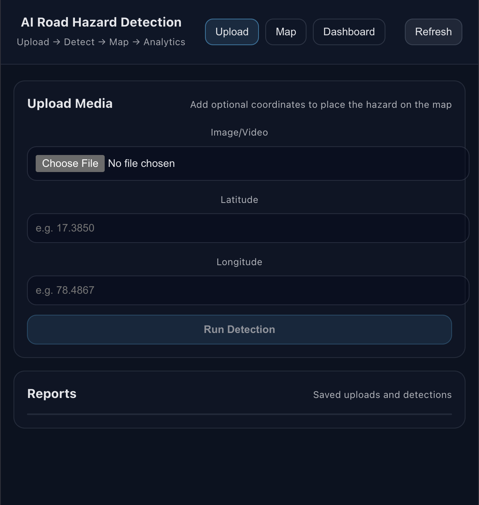
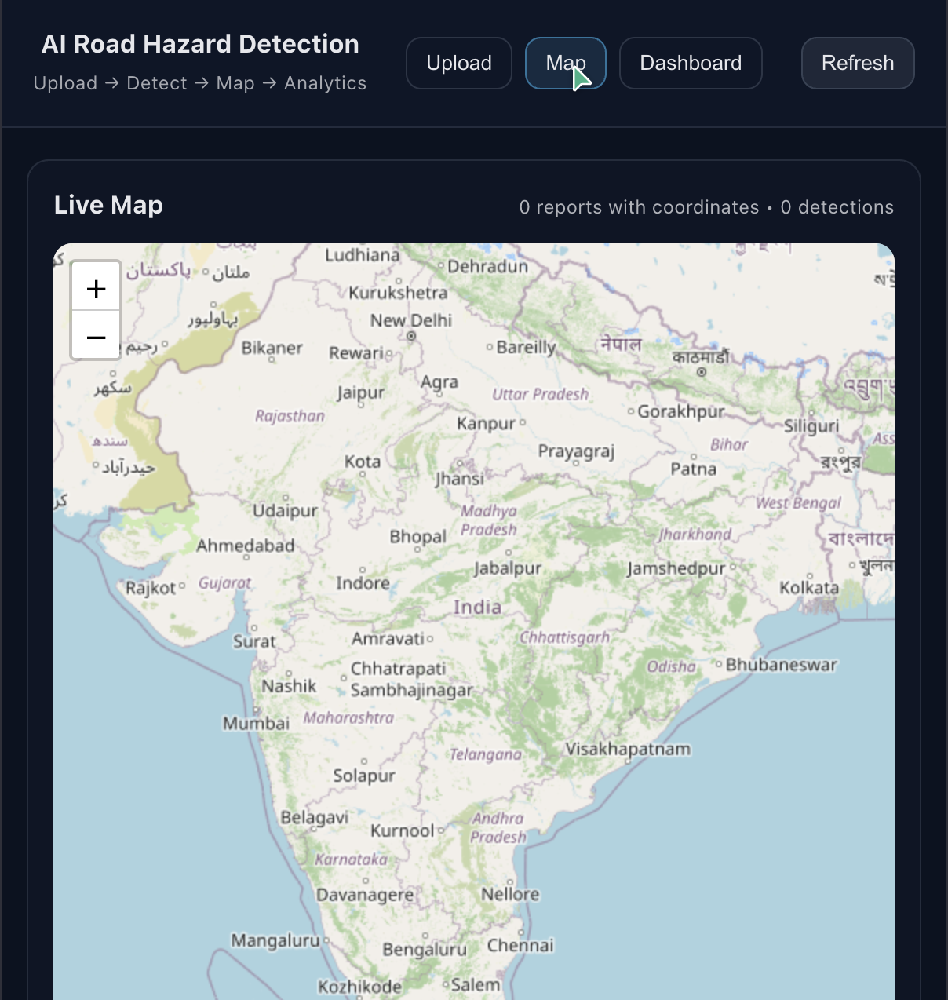
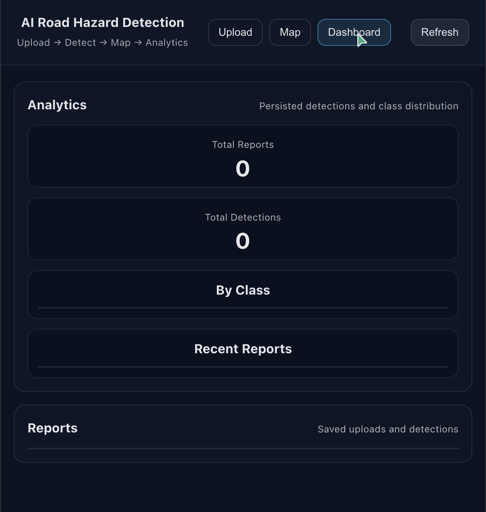

## AI Road Hazard Detection System (MVP)

React + FastAPI app where a user uploads a road image/video, YOLO runs detection, and results are stored + shown on a map and analytics dashboard.

### Problem Statement
- Potholes and road hazards cause vehicle damage, accidents, and increased maintenance costs
- Smart mobility apps need hazard-aware routing and safer navigation signals
- Manual road monitoring and reporting does not scale across large road networks

### Features (MVP)
- Upload image/video with optional latitude/longitude
- YOLOv8-based hazard detection on uploaded media (classes depend on the chosen weights/dataset)
- Map visualization of reported hazard coordinates (markers + simple heat overlay)
- Hazard analytics (totals, per-class counts, recent reports)
- FastAPI backend + SQLite persistence (easy to switch to Postgres)
- Scalable foundation for smart-city integrations (API-first design)

### Future Scope
- GPS integration and live geotagging from mobile capture
- Live camera/webcam streaming inference (edge or server-side)
- Traffic intelligence overlays and time-based hotspot trends
- Municipal operations dashboard (ward/zone analytics, SLA tracking, work orders)
- Route optimization and “safer route” recommendations using hazard history

### Screenshots
Add images to `docs/screenshots/` and update these links:






### Backend (FastAPI)

Prereqs:

Setup:
```bash
cd backend
python -m venv .venv
source .venv/bin/activate
pip install -r requirements.txt
```

Run:
```bash
cd backend
source .venv/bin/activate
uvicorn app.main:app --reload --port 8000
```

Env (optional):
- `DATABASE_URL` (default: `sqlite+aiosqlite:///./app.db`)
- `YOLO_WEIGHTS` (default: `yolov8n.pt`)
- `UPLOAD_DIR` (default: `./uploads`)

### Frontend (React)

Prereqs:
- Node.js 18+

Setup:
```bash
cd frontend
npm install
```

Run:
```bash
cd frontend
npm run dev
```

Frontend env:
- Create `frontend/.env`:
  - `VITE_API_BASE_URL=http://localhost:8000`
  - `VITE_MAP_TILE_URL=...` (optional; default is OpenStreetMap tiles)
  - `VITE_MAP_ATTRIBUTION=...` (optional)

### Deploy

This project has a heavy ML dependency (YOLO + torch). Vercel is a good fit for the React UI, but the FastAPI inference backend should be deployed to a server/container platform (Render/Railway/Fly.io/EC2).

#### Deploy frontend to Vercel
- Import the GitHub repo in Vercel
- Set the Root Directory to `frontend`
- Build Command: `npm run build`
- Output Directory: `dist`
- Add env var: `VITE_API_BASE_URL=https://<YOUR_BACKEND_HOST>`

#### Deploy backend (container)
The backend includes a Dockerfile at `backend/Dockerfile`.

Example command:
```bash
docker build -t road-hazard-backend ./backend
docker run -p 8000:8000 -e CORS_ORIGINS=https://<YOUR_VERCEL_DOMAIN> road-hazard-backend
```
